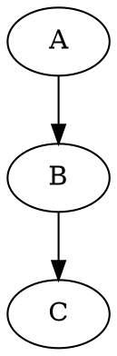
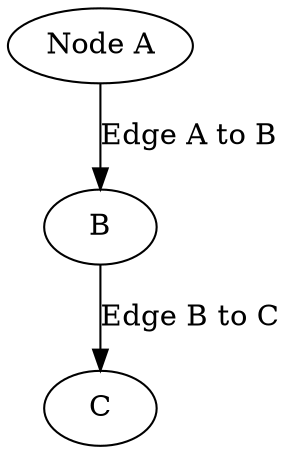
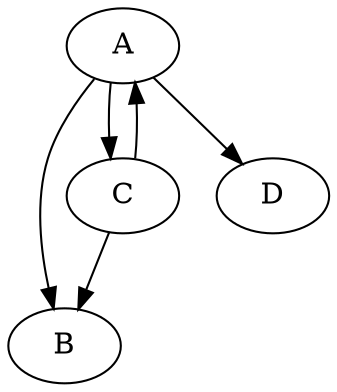

DOT is the textual language used by GraphViz to describe graphs. It is human-readable and supports descriptions of subgraphs and visual attributes such as color, width and labels.

Gephi currently does not provide complete support for DOT: subgraphs, custom attributes and sizes are not supported. Gephi imports labels and colors when present, and supports both directed and undirected graphs.

## Resources

- GraphViz website: http://www.graphviz.org/

## Basic example

## Labels example

## Adjacency lists example

