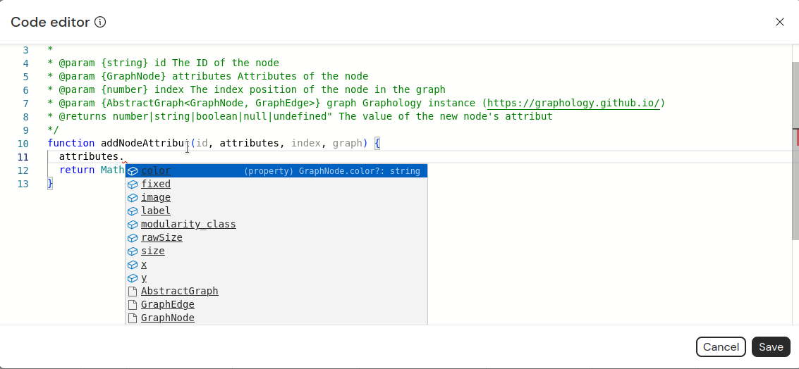

Gephi-Lite does not have a plugin marketplace, but it includes a native scripting language: JavaScript.
In many places, this lets you write JavaScript code instead of using the standard features.

## Nodes/Edges filtering

From the **Filters** menu, choosing **Custom script** opens the script editor, allowing you to implement this function:

````js
/**
 * Define a custom filter function.
 * The function is executed for each node.
 * If it returns true, the node is included in the result set; otherwise, it is excluded.
 *
 * @param {string} id ID of the item
 * @param {GraphNode} attributes Attributes of the item
 * @param {AbstractGraph<GraphNode, GraphEdge>} graph Graphology instance (https://graphology.github.io/)
 * @return {boolean} TRUE if the item should be kept in the graph, FALSE to filter it
 */
function filter(id, attributes, graph) {
  //
  // Your code goes here
  //~~~~~~~~~~~~~~~~~~~~
  //
  // Write here your own function that filter nodes.
  // For each nodes, this function will be called, and if its result is true, the node is kept.
  //
  // Example 1: keeping nodes that have a property 'age' superior than 18
  // --------------------------------------------------------------------
  // ```
  // return attributes.age > 18;
  // ```
  //
  // Example 2: filtering node that have a property 'age' below 18 and with a degree inferior to 10
  // ----------------------------------------------------------------------------------------------
  // ```
  // return attributes.age < 18 ? graph.degree(id) < 10 : true;
  // ```
  //
  // Example 3: filtering nodes on which the property 'job' is not defined
  // ---------------------------------------------------------------------
  // ```
  // return attributes.job !== undefined;
  // ```
  //
  return true;
}
````

## Custom layout

In the **Layout** menu, selecting **Custom layout** opens the script editor, where you can implement this function:

````js
/**
 * Function that returns coordinates for the specified node.
 *
 * @param {string} id The ID of the node
 * @param {GraphNode} attributes Attributes of the node
 * @param {number} index The index position of the node in the graph
 * @param {AbstractGraph<GraphNode, GraphEdge>} graph The graphology instance (https://graphology.github.io/)
 * @returns {x: number, y: number} The computed coordinates of the node
 */
function nodeCoordinates(id, attributes, index, graph) {
  //
  // Your code goes here
  //~~~~~~~~~~~~~~~~~~~~
  //
  // Write here your own function that spatialized nodes.
  // For each node, this function will be called to get its coordinates.
  //
  // Example 1: A random layout on a 1000x1000 space
  // ------------------------------------------------------------------------
  // ```
  // return { x: Math.random() * 1000, y: Math.random() * 1000 };
  // ```
  //
  // Example 2: Circular layout
  // ----------------------------------------------------------------------
  // ```
  // return { x: Math.cos(index * (Math.PI *2) / graph.order) * 500, y: Math.sin(index * (Math.PI *2) / graph.order) * 500 };
  // ```
  //
  return { x: Math.random() * 1000, y: Math.random() * 1000 };
}
````

## Scripted node/edge attribute

On the **Data** page, choosing **Create nodes scripted attribute** in the **Data creation** menu opens the script editor, allowing you to implement this function:

````js
/**
 * Function that returns a new attribute value for the specified node/edge.
 *
 * @param {string} id The ID of the node/edge
 * @param {GraphNode} attributes Attributes of the node/edge
 * @param {number} index The index position of the node/edge in the graph
 * @param {AbstractGraph<GraphNode, GraphEdge>} graph Graphology instance (https://graphology.github.io/)
 * @returns number|string|boolean|null|undefined" The value of the new node/edge's attribut
 */
function addAttribut(id, attributes, index, graph) {
  //
  // Your code goes here
  //~~~~~~~~~~~~~~~~~~~~
  //
  // Write here your own function that returns the value for your new attribut.
  //
  // Example 1: If you have an attribut named 'valid' which take 0 or 1,
  // you can cast it into a boolean
  // ------------------------------------------------------------------------
  // ```
  // return attributes.valid === 1;
  // ```
  //
  // Example 2: If you have attributs named 'firstname' and 'lastname'
  // you can concatenate them (usefull for graph label)
  // -----------------------------------------------------------------------
  // ```
  // return (attributes.firstname || "") + " " + (attributes.lastname || ");
  // ```
  //
  return Math.random();
}
````

## Script editor

The script editor is displayed in a modal.



The editor is based on [Monaco](https://microsoft.github.io/monaco-editor/), so if you use VS Code, it should feel familiar.
Types are defined for each function parameter (such as `attributes` or `graph`), enabling autocompletion.
