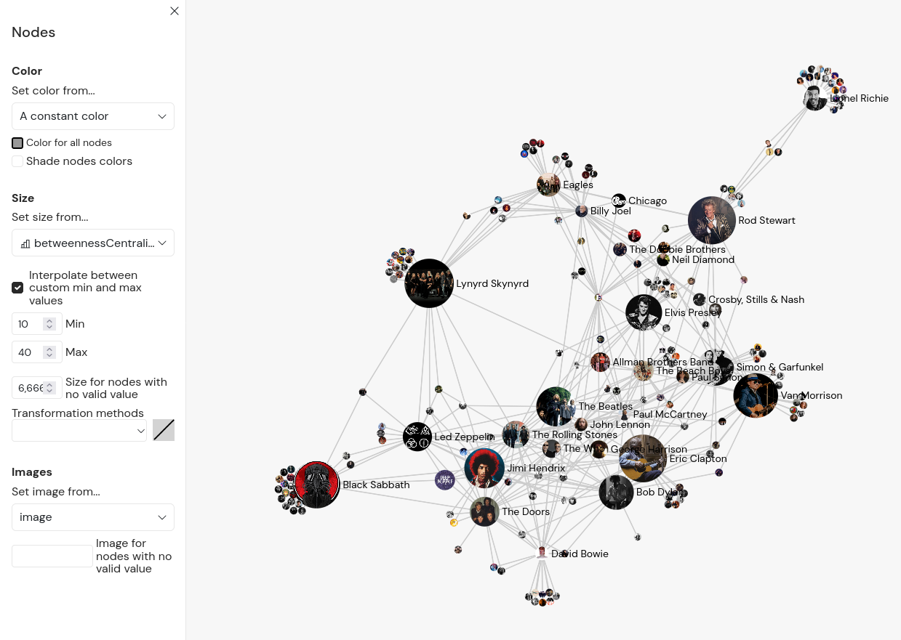

## What makes Gephi Lite _light_?

When the Gephi team decided to launch a new web "spinoff" of Gephi based on [various previous and existing experiences](https://archive.fosdem.org/2024/schedule/event/fosdem-2024-3253-bridging-research-and-open-source-the-genesis-of-gephi-lite/), we decided against calling it "Gephi Web", because:

- The user interface would not be the exact same (in a good way, because web technologies are better than the current Java Gephi stack for user interfaces development)
- It would not handle the same scales, not even closely (in a bad way, because this time, JavaScript as way less control on memory, CPU and GPU usage than Java)
- The features would probably not even be the exact same

We decided to go for **Gephi Lite**, meaning:

- It would be **lighter** in terms of features, and would target less expert users
- It would have a **lighter** user interface, with less information and noise
- It would handle **lighter** graphs

## Dynamic graph appearance

One core difference between Gephi and Gephi Lite is that Gephi Lite handles the graph appearance **dynamically**, rather than statically.

The reason of this is that we wanted to have captions in Gephi Lite from day one, and for this, we need to keep track of why are nodes and edges rendered the way they are.

### Gephi behaves like Photoshop

In Gephi, when users colorize nodes for instance, it changes the colors the stored color value of each node in the data model, and does not try to remember why. This makes it very easy for users to do exactly what the want (like "I want this specific node to be red" or "I have a very expert use case, where nodes are not colored the same way according to their type" for instance). It's like using Photoshop: Pixels have one value, and users can modify that value _exactly_ the way they want, 

The main tradeoff is that Gephi can't "explain" why nodes and edges are rendered the way they are, so there can't be any caption.

### Gephi Lite behaves like Excel

In Gephi Lite, when users update nodes colors from the _Appearance_ panel, it updates the nodes coloring rules in the data model. Then, any time anything changes in the graph data, the nodes are dynamically colored, before the graph is rendered to the stage. It's like using Excel with formulas: Users can apply different way to describe what should be in a cell, and the value in it will _reactively_ be updated.

#### **Advantages**

This allows basically two main things:

1. Gephi Lite has a **dynamic caption**
2. When using **dynamic attributes** (like node degrees for sizes), when they become updated (because of data updates of filters modifications), the graph appearance is **instantly impacted**

#### **Main cost**

Users can only modify nodes and edges appearance in a way that Gephi Lite can **explain** through its caption.

There is a way out of this system, though: It is possible to directly use a **data column** for a given **visual variable**. That is exactly what happens by default when a GEXF from Gephi is loaded, for instance:

- There is a node attribute, named `color`, of type "color", containing color strings, that are used to color nodes;
- There is a node attribute, named `size`, of type "number", containing positive numbers, that are used for nodes sizes;
- etc...

## The graph algorithms are not the same

Gephi Lite has been made possible by two JavaScript libraries written by people close to Gephi:

- [sigma.js](https://www.sigmajs.org/), a WebGL-based graph rendering engine
- [graphology](https://graphology.github.io/), a JavaScript graph model

Graphology has been written by [Guillaume Plique](https://yomguithereal.github.io/), partly to enable JavaScript client application and server scripts, to **analyze networks** for social sciences. To do this, he implemented [various graph algorithms](https://graphology.github.io/standard-library/), including many that are already inside Gephi.

But some algorithms can exist in Gephi and not in graphology, and some algorithms implemented in graphology can be missing in Gephi too. That explains why the lists of available algorithms can differ between Gephi and Gephi Lite.

## Additional features

Since Gephi Lite is a web application, that enabled various feature opportunities, some of which are already implemented. Here are some features that Gephi Lite offer, that you cannot find in Gephi:

### Cloud-like behavior with GitHub

This feature allows connecting to GitHub from Gephi Lite, and save and load graphs as [GitHub Gists](https://gist.github.com/).

:::info

Please read the [dedicated documentation page](./github-auth.md) to know more.

:::

### Custom scripts

This feature allows writing some JavaScript code directly from Gephi Lite's UI, to apply simple layouts, filter nodes / edges, or update / create new data.

:::info

Please read the [dedicated documentation page](./custom-scripts.md) to know more.

:::

### Experimental features

As Gephi Lite is built with modern web technologies, it makes it quite easy to draft and develop new features. This is a good opportunity for the Gephi team to **try new features** in Gephi Lite, that might end up as plugins or core features in Gephi later.
:::info

Please read the [dedicated documentation page](./experimental.md) to know more.

:::

### Node images

<figure>

<figcaption>A [Spotify artists network](https://medium.com/@vespinozag/learn-how-to-make-a-network-in-gephi-lite-and-add-images-to-the-nodes-i-give-you-the-gexf-file-76635f3aab53) with artists pictures displayed on the nodes, made by [Dr. Veronica Espinoza](https://medium.com/@vespinozag)</figcaption>
</figure>

As [sigma.js](https://www.sigmajs.org) does support [node images](https://www.sigmajs.org/storybook/?path=/story/sigma-node-image--node-images), the cost was too low not implement this in Gephi Lite. So, users can open the `Appearance > Nodes` menu, and select a URL field in the `Images` section.

### Captions

[As described earlier](#dynamic-graph-appearance), Gephi Lite does apply the graph appearance rules dynamically, which makes it able to generate a dynamic caption of the visual variables used to render the graph.

## Missing features

On the other side, some core features from Gephi are not implemented in Gephi Lite, either because we did not find a way to do it in a "lite-enough" way, or because we did not find the time yet.

Here are the main ones:

### "Preview" tab and SVG / PDF exports

One of the main ends of Gephi is to **generate a proper map image of a graph**. This is implemented from a `Preview` panel, where users can determine how the nodes and edges must appear in the exported image.

The particular part might be implemented in the future in Gephi Lite, but probably directly in the `Graph` tab. Indeed, it does not seem "light enough" to have a second very similar interface as the current `Appearance` menu.

Also, at the moment, Gephi Lite only supports image export - and only because sigma.js offers [a way to do](https://www.sigmajs.org/storybook/?path=/story/sigma-export-image--available-options) this already. Graphology does allow [export SVG images](https://graphology.github.io/standard-library/svg.html) of graphs, but the code is not customizable enough yet to be used in Gephi Lite. It might come in the future, though.

### Timeline

Gephi allows animating a timeline through a dynamic graph. In a dynamic graph, nodes and edges can have a "temporal existence" (i.e. they only exist on some periods of time), and nodes and edges attributes values can vary along time.

Gephi Lite does not support dynamic graph. The closest feature Gephi Lite does offer is the dynamic dates filtering range, on nodes / edges date attributes as below:

import VideoDynamicDegree from "./assets/dates-filtering.webm";

<video preload="metadata" controls="controls" width="100%">
  <source src={VideoDynamicDegree} type='video/webm; codecs="av01.0.08M.08.0.110.01.01.01.0"' />
</video>

### Plugins

One of the biggest features of Gephi is the possibility to **implement and share plugins**, to allow Gephi to do more things. As Gephi Lite is a full-client web application, we did not find any simple way to implement something similar. The best we have for now are the [custom scripts](./custom-scripts.md), and this might evolve in the future.