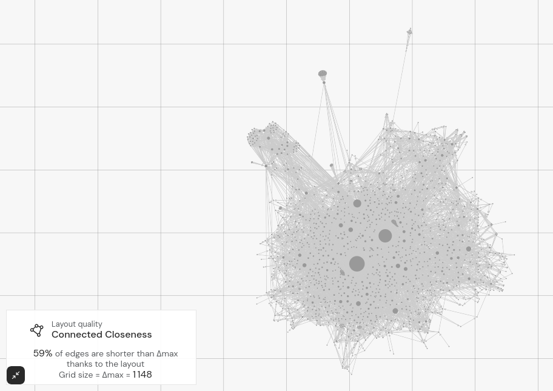
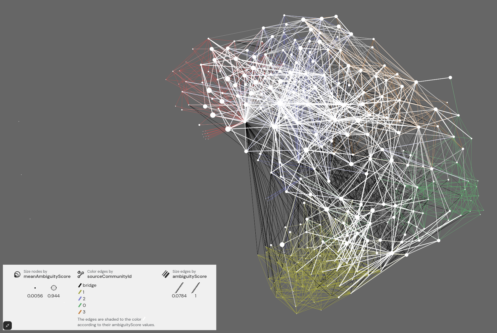

As Gephi Lite is built with modern web technologies, it makes it quite easy to draft and develop new features. This is a good opportunity for the Gephi team to **try new features** in Gephi Lite, that might end up as plugins or core features in Gephi later. Two such experimental features have been implemented already.

## Connected-closeness

At [Gephi Week 2024](https://gephi.wordpress.com/2024/06/13/gephi-week-2024-peek-from-the-inside/), the team decided to try to implement a way to visualize Mathieu Jacomy's **connected-closeness** in Gephi Lite. This metric aims at evaluating how successfully a layout does bring together in the plan connected pairs of nodes, while keeping disconnected pairs distant.

The way it's implemented in Gephi Lite is that users can toggle connected-closeness from the `Layout > Layout Quality` menu. Then, a grid of size Δmax will constantly be displayed, and the caption will show how to read it.

You can read more about the connected-closeness:
- In the related paper, [_Connected-closeness: A Visual Quantification of Distances in Network Layouts_](https://jgaa.info/index.php/jgaa/article/view/paper626)
- In a very detailed Observable notebook, [_Highlights on connected-closeness_](https://observablehq.com/@jacomyma/highlights-on-connected-closeness)

## Louvain edges ambiguity

At [Gephi Week 2022](https://gephi.wordpress.com/2022/10/16/gephi-week-2022-debriefing/) this time, some people started to work on a way to evaluate how _ambiguous_ community detection algorithms can be. This led to a dedicated workshop in december 2024, where a team gathered to keep digging.

This ended up in a way to evaluate how consistently the [Louvain method for community detection](https://en.wikipedia.org/wiki/Louvain_method) does put extremities of each edge in the same community or not. And various other metrics are derived from this, to map where does the _ambiguity_ lies in the graph.

Stay tuned, hopefully more documentation might come later about this!