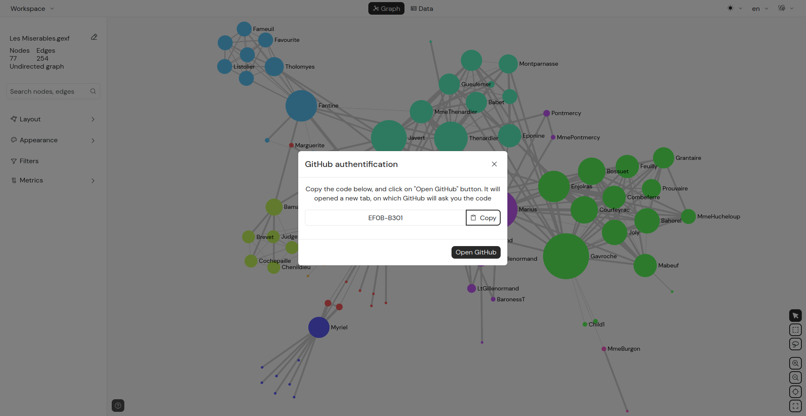
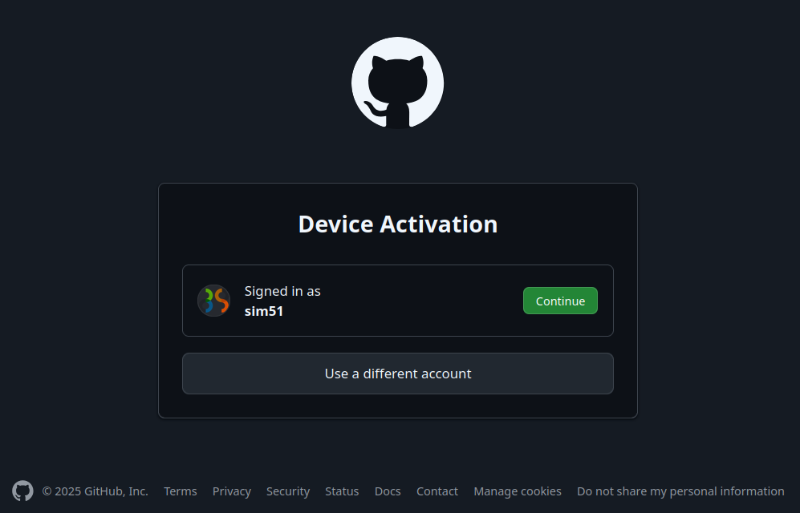
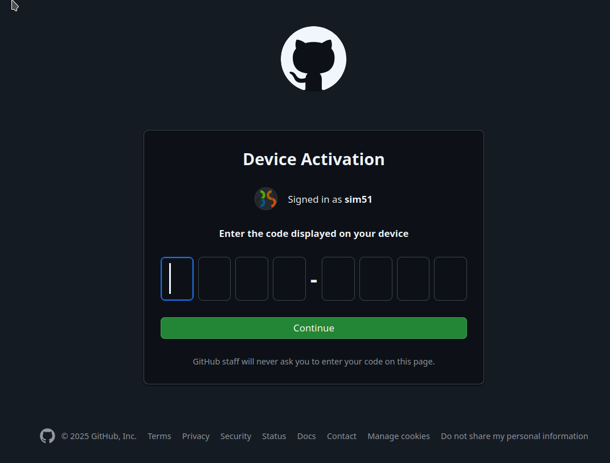
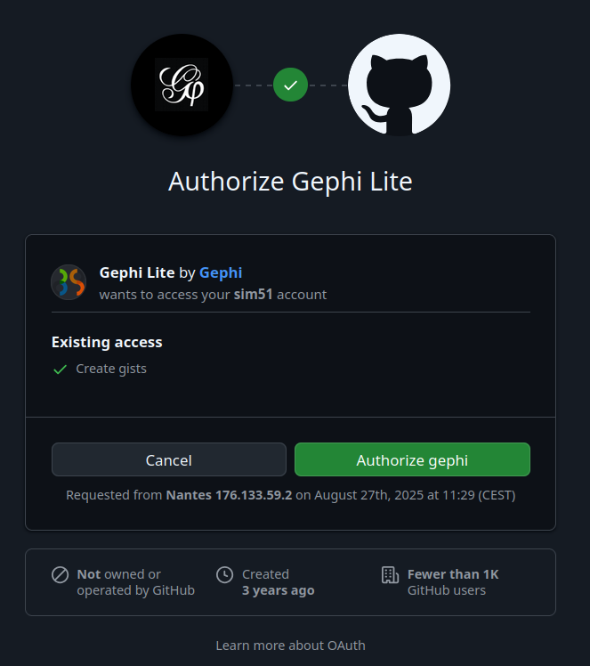
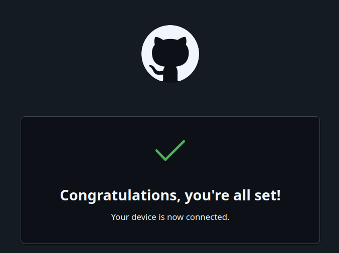
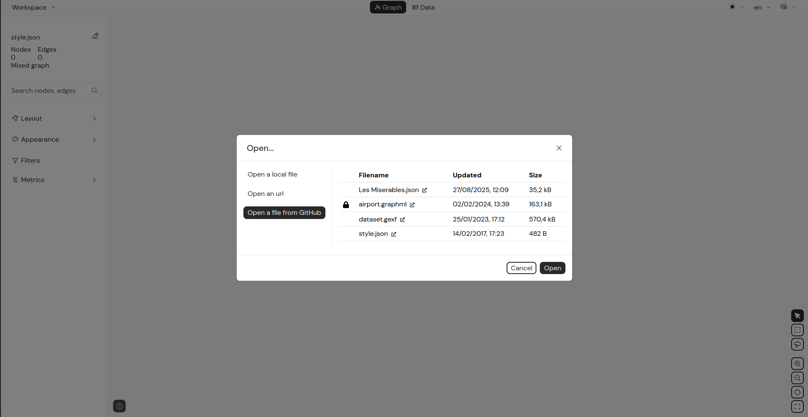
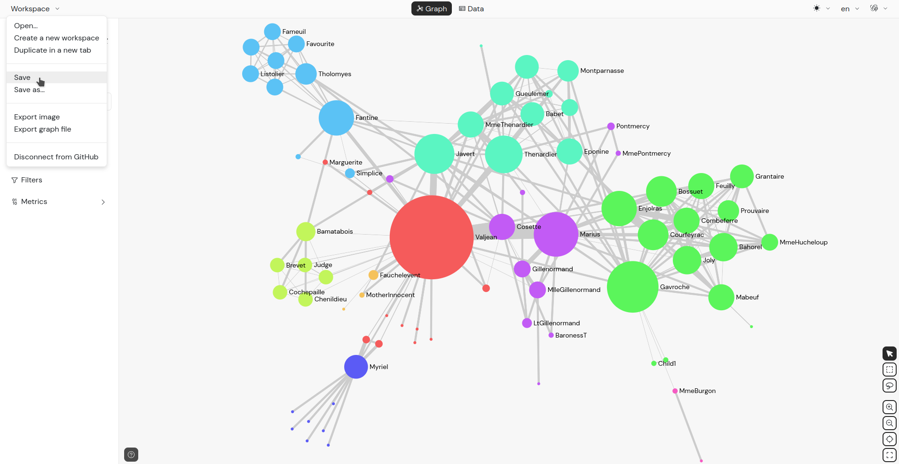
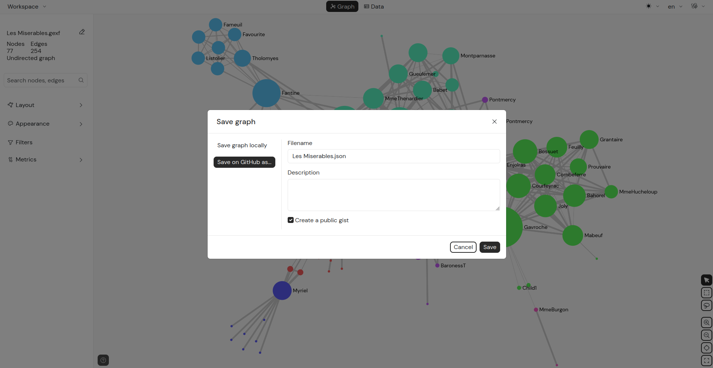

Gephi Lite is serverless and can only open files from your local computer or any public graph available on the internet.

However, many people now prefer working in the cloud with their favorite applications. 
That’s why we provide **GitHub integration**,  once authenticated, you’ll be able to open and save graphs directly from your Gists.

## Authentication

:::info
Gephi Lite uses GitHub OAuth [Device Flow](https://docs.github.com/en/apps/oauth-apps/building-oauth-apps/authorizing-oauth-apps#device-flow).
:::

1. Open the `Workspace` menu and click on the `Link to GitHub` item.  
   The following modal should be displayed:

   

2. Copy the displayed code and click on the `Open GitHub` button.  
   This opens a GitHub page in a new browser window.

   

3. Sign in to GitHub and click `Continue`. The **Device Activation** page will appear, asking you to enter the code.

   

4. Enter the code and click `Continue`. The **Authorization** page will then appear.

   

5. Verify that the authorization request is from the `Gephi` organization and for the `Gephi-Lite` project.  
   If correct, and if you agree to allow Gephi Lite access to your Gists, click `Authorize gephi`.

   

6. Once authorized, you can close the window and return to Gephi Lite.  
   If the modal is closed, your Gephi Lite instance is now connected to GitHub.

## Open a graph from GitHub

1. Open the `Workspace` menu and click on the `Open from GitHub` item.  
   A new panel will appear on the left side.  

2. Click on `Open a file from GitHub`. A table will be displayed with a list of your Gists (most recent at the top).

   

:::info
Gephi Lite filters gists by filename extension. Only files with `.json`, `.gexf`, or `.graphml` are listed.
:::

3. Select a file by clicking on its row in the table, then click the `Open` button.

## Save a graph previously opened from GitHub

If you opened a gephi-lite graph file from GitHub, saving modifications is straightforward:

1. Open the `Workspace` menu.  
2. Click on the `Save` item.  

   

This will update your GitHub gist with the changes, creating a new revision.

:::info
If you opened a `.gexf` or `.graphml` file from GitHub, the `Save` option will not be available.  
In that case, use **Save As** instead (see below).
:::

## Save a graph to your GitHub profile

If you are connected to GitHub, you can save any graph to your account:

1. Open the `Workspace` menu.  
2. Click on the `Save As` item.  
3. In the modal, select `Save on GitHub As` from the left menu.  

   

4. Fill in the form and validate it.  

🎉 Congrats! Your graph is now saved in your GitHub profile.
