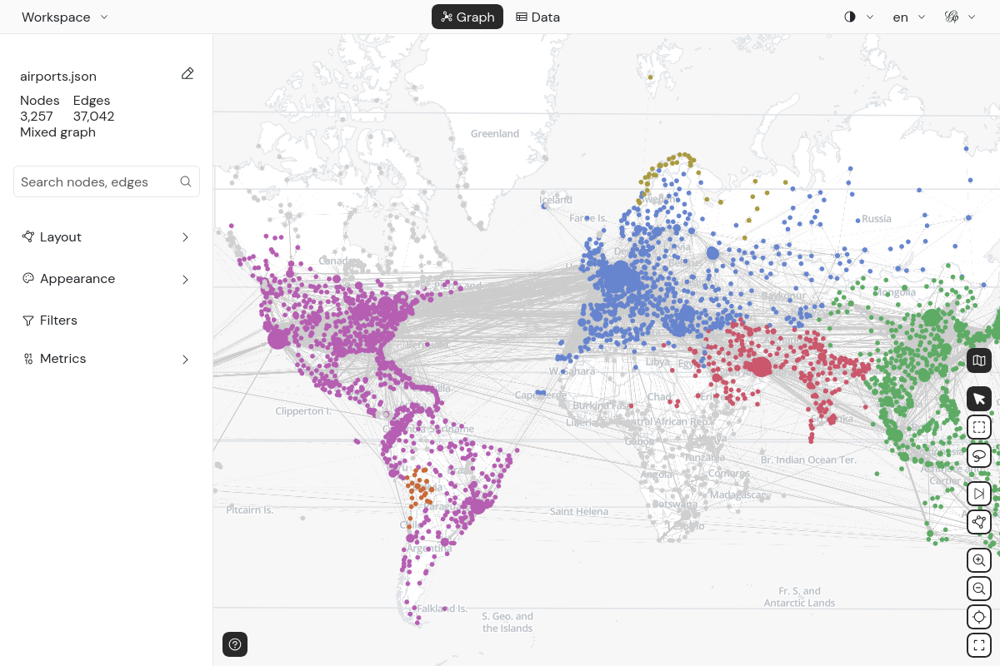
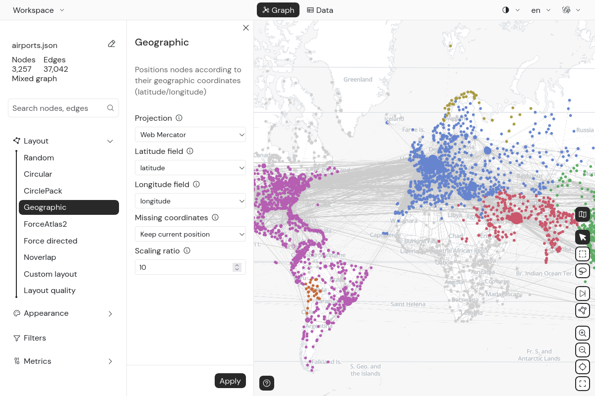
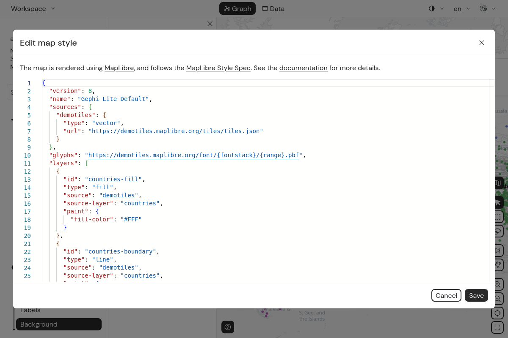

Since version 1.1, Gephi Lite can place nodes from their geographic coordinates, and display a map behind the graph.



## Geographic layout

The **Geographic** layout is in the `Layout` panel. It positions nodes according to their latitude and longitude.

It needs two **number** node attributes: one for the latitude, one for the longitude. Gephi Lite tries to prefill them,
from attributes named like `lat` or `latitude`, and `lng`, `lon`, `long` or `longitude`.

### Parameters



- **Projection**: how coordinates are projected on the plane:
  - `Web Mercator` (default): the only one that allows displaying a [map background](#map-background)
  - `Equirectangular`
  - `Equal Earth`
  - `Natural Earth 1`
- **Latitude field** and **Longitude field**: the node attributes holding the coordinates
- **Missing coordinates**: what to do with nodes that don't have valid coordinates:
  - `Keep current position` (default): these nodes don't move
  - `Place in grid (left of map)`: these nodes are arranged in a grid, on the left of the geolocated nodes
  - `Neighbors barycenter + grid`: each of these nodes is placed at the barycenter of its geolocated neighbors. Nodes
    with no geolocated neighbors go in the grid.
- **Scaling ratio**: multiplies all the resulting coordinates (default: `10`)

:::info
The geographic layout runs once: it does not keep running like ForceAtlas2. You can still drag nodes.
:::

## Map background

When the last layout run is the **Geographic** layout with the **Web Mercator** projection, the map background is
automatically enabled. A map button also appears in the graph controls, at the bottom right, to toggle it on and off.

When the map is displayed, node and edge sizes are adapted so that the graph stays readable on top of it.

:::warning
If you run another layout, or the geographic layout with another projection, the map background is disabled, since nodes
positions don't match the map anymore.
:::

## Map style

The map is rendered using [MapLibre](https://maplibre.org/). Its look is described by a JSON style, following the
[MapLibre Style Spec](https://maplibre.org/maplibre-style-spec/).

To edit it, open `Appearance > Background`, and click the `Edit` button in the **Map background** section. This opens a
JSON editor, prefilled with the current style. The style must be a valid JSON object.



Once a custom style is set, a reset button appears next to the `Edit` button, to go back to the default style.

The map style is part of the appearance, so it is saved in
[Gephi Lite workspace files](./file-formats.md#gephi-lite-workspace).

### Default style

By default, Gephi Lite uses the [MapLibre demo tiles](https://demotiles.maplibre.org/). They show countries, their
borders, and their names. The colors follow Gephi Lite's light or dark theme.

### Using other tiles

You can point the style `sources` to any vector or raster tiles source supported by MapLibre. For instance, here is a
minimal style using [OpenStreetMap](https://www.openstreetmap.org/) raster tiles:

```json
{
  "version": 8,
  "sources": {
    "osm": {
      "type": "raster",
      "tiles": ["https://tile.openstreetmap.org/{z}/{x}/{y}.png"],
      "tileSize": 256,
      "attribution": "© OpenStreetMap contributors"
    }
  },
  "layers": [{ "id": "osm", "type": "raster", "source": "osm" }]
}
```

MapLibre also supports [PMTiles](https://docs.protomaps.com/pmtiles/) archives. They are single files that can be
hosted on any static server, without a tiles server. Use the `pmtiles://` prefix in the source URL:

```json
{
  "sources": {
    "my-tiles": {
      "type": "vector",
      "url": "pmtiles://https://example.com/my-tiles.pmtiles"
    }
  }
}
```

If the map cannot be loaded (invalid style, unreachable tiles...), Gephi Lite shows error notifications, and the
details are logged in the browser console.
