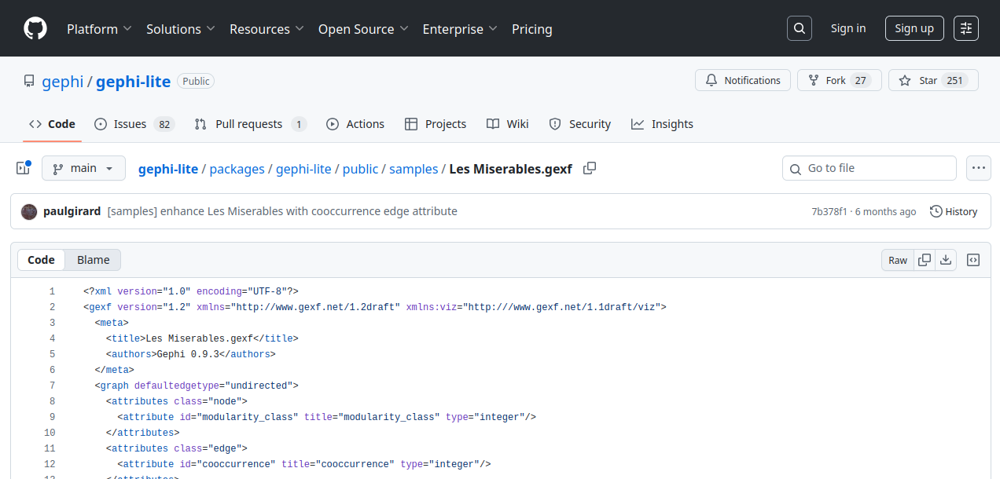
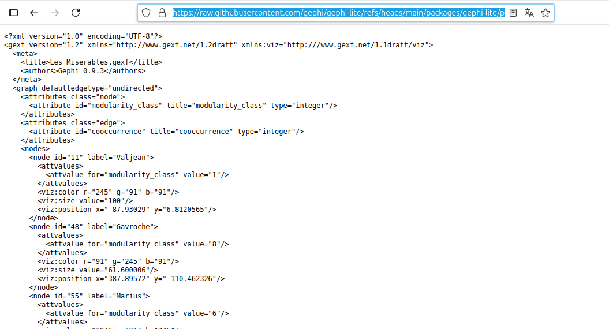
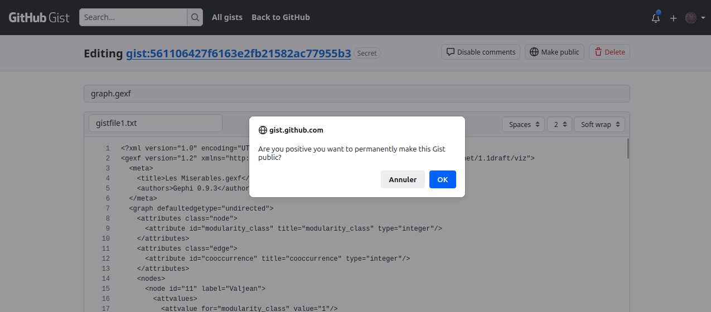

Gephi Lite can open any Gexf, GraphMl or Gephi-Lite JSON file which is hosted on the web.

To automatically load a graph, add the query parameter `file` followed by the URL of your graph file.

**Format:** https://lite.gephi.org/?file=URL_TO_YOUR_GRAPH

Here’s a sample link that opens the classic _Les Misérables_ dataset:

https://lite.gephi.org/?file=https://raw.githubusercontent.com/gephi/gephi-lite/refs/heads/main/packages/gephi-lite/public/samples/Les%20Miserables.gexf

Click the link and you’ll see the graph load automatically.

Your `URL_TO_YOUR_FILE` can point to any supported [file formats](./file-formats.md):

- a GEXF file, in which case your filename must end with`.gexf` extension
- a GraphML file, in which case your filename must end with`.graphml` extension
- a Gephi Lite JSON file format, in which case your filename must end with `.json` extension

Here are a few more examples of Gephi Lite graph urls:

A GEXF file: [https://lite.gephi.org/?file=https%3A%2F%2Fwww.ouestware.com%2Ftalks%2FGephiLite%40FOSDEM2024%2Fgephi-lite.gexf](https://lite.gephi.org/?file=https%3A%2F%2Fwww.ouestware.com%2Ftalks%2FGephiLite%40FOSDEM2024%2Fgephi-lite.gexf)

A GraphML file: [https://lite.gephi.org/?file=https://raw.githubusercontent.com/gephi/gephi-lite/refs/heads/main/packages/gephi-lite/public/samples/airlines.graphml
](https://lite.gephi.org/?file=https://raw.githubusercontent.com/gephi/gephi-lite/refs/heads/main/packages/gephi-lite/public/samples/airlines.graphml)

:::warning
To use this feature you must host your graph file on a server which authorizes [Cross-origin resource sharing (CORS)](https://developer.mozilla.org/fr/docs/Web/HTTP/Guides/CORS).

In short, this means that the server publishing your network file must either allow any domains (`Access-Control-Allow-Origin: *`) or lite.gephi.org domain (`Access-Control-Allow-Origin: lite.gephi.org`) to access the file.

Remember to set the HTTP `Access-Control-Allow-Origin` header on your own server if you want to share graph files in Gephi Lite.
:::

To our knowledge the only free hosting services which have an open CORS policy are provided by GitHub:

- Github repository: any graph file in a public github repository can be loaded into Gephi Lite using the `raw` link
- Gist: graph files hosted as Github Gist are also accessible (it's what Gephi Lite uses for the [Github Integration](./github-auth) feature)

## Find the right URL from Github repository

In the Gephi Lite Github repository you'll find the `Les Miserables.gexf` file in the samples directory: https://github.com/gephi/gephi-lite/blob/main/packages/gephi-lite/public/samples/Les%20Miserables.gexf

On this Github page spot the `Raw` button on the top right corner of the file content panel. This button is a link to the `raw` URL of the file, i.e. an URL to the content of the file and not to the Github page showing you the file.

This the URL you have to use to share your network with others using Gephi Lite.

Either use your web browser `copy link` feature (right-click on the button) or click on it and then copy the URL of the content.

This how you can retrieve the `raw` URL from Github. For this `Les miserables.gexf` file the right link to open it directly in Gephi Lite is:

https://lite.gpehi.org/?file=https://raw.githubusercontent.com/gephi/gephi-lite/refs/heads/main/packages/gephi-lite/public/samples/Les%20Miserables.gexf

## Find the right URL from Github Gist

:::info
The easiest way to use Github Gist with Gephi Lite is to use the integrated [Github integration feature](./github-auth.md).
:::

If you want to share a Github Gist, you have to make sure that:

1. the gist filename contains the right extension : `.gexf`, `.graphml` or `.json`
2. the Github Gist is public

To learn how to create a public gist, see [Official Fist documentation](https://docs.github.com/en/get-started/writing-on-github/editing-and-sharing-content-with-gists/creating-gists),

To make a private Gist public open the Gist Edit page and spot the `Make public` button on th right side of the page header:

